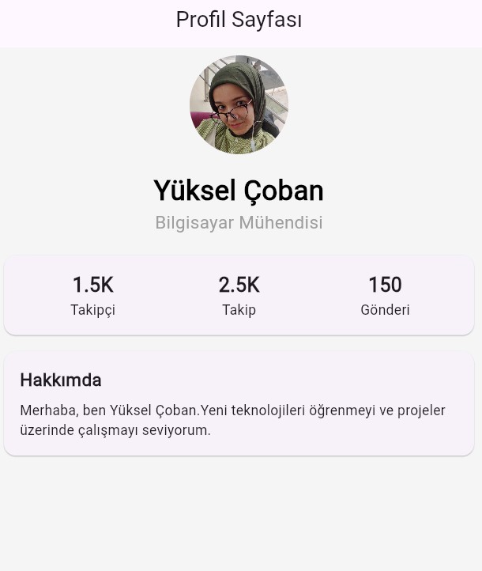

# Flutter Profil Uygulaması

Bu proje, Flutter kullanılarak geliştirilmiş modern ve şık bir **Profil Arayüzü** tasarımıdır. Kullanıcının temel bilgilerini, istatistiklerini ve hakkındaki kısa biyografiyi görsel olarak etkileyici bir şekilde sunar.

## Özellikler

* **Profil Fotoğrafı:** `CircleAvatar` ile yuvarlak profil resmi desteği.
* **İstatistik Paneli:** Takipçi, takip ve gönderi sayılarını gösteren dinamik `Row` yapısı.
* **Hakkımda Bölümü:** `Card` widget'ı kullanılarak oluşturulmuş düzenli biyografi alanı.
* **Responsive Tasarım:** `Expanded` ve `Column` widget'ları sayesinde farklı ekran boyutlarına uyumlu yapı.
* **Debug Banner:** Temiz bir görünüm için debug bandı kaldırılmıştır.

## Kullanılan Teknolojiler

* **Framework:** [Flutter](https://flutter.dev)
* **Language:** [Dart](https://dart.dev)
* **Widgets:** Material Design (Scaffold, AppBar, Card, CircleAvatar, Column, Row, Padding)

## Ekran Görüntüsü

| Profil Sayfası |
| :---: |
|  ||


## Kurulum ve Çalıştırma

1.  Bu projeyi bilgisayarınıza indirin veya klonlayın.
2.  Terminalde proje dizinine gidin.
3.  Gerekli paketleri yüklemek için şu komutu çalıştırın:
    ```bash
    flutter pub get
    ```
4.  Uygulamayı başlatmak için:
    ```bash
    flutter run
    ```


